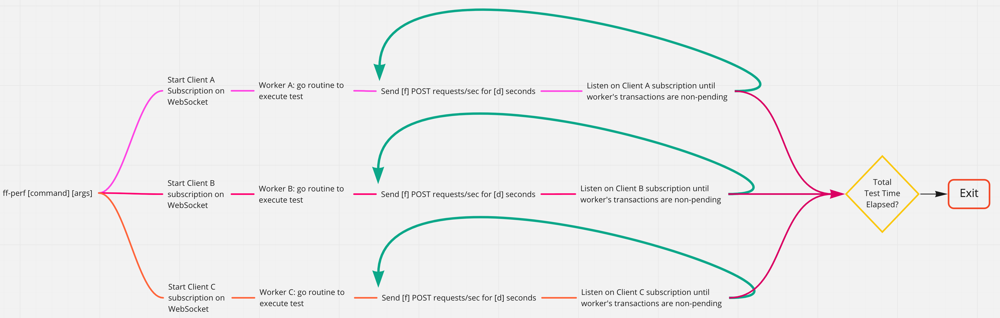

# FireFly Performance CLI

FireFly Performance CLI is a HTTP load testing tool that leverages [Vegeta](https://github.com/tsenart/vegeta) to generate a constant request rate against a [FireFly](https://github.com/hyperledger/firefly) network and measure performance. This it to be confident [FireFly](https://github.com/hyperledger/firefly) can perform under normal conditions for an extended period of time.

## Items Subject to Testing

- [x] Broadcasts (`POST /messages/broadcasts`)
- [x] Private Messaging (`POST /messages/private`)
- [x] Mint Tokens (`POST /tokens/mint`)
- [x] Transfer Tokens (`POST /tokens/transfer`)
- [x] Burn Tokens (`POST /tokens/burn`)
- [x] Fungible vs. Non-Fungible Token Toggle
- [x] Mint/Transfer/Burn Token with message

## Run a test

`ff-perf -n http://localhost:5000`

## Options

```shell
Usage:
  ff-perf [flags]

Flags:
  -f, --frequency int          Requests Per Second (RPS) of each worker (default 10)
  -h, --help                   help for ff-perf
  -d, --jobDuration duration   Duration of each job done by worker (default 1m0s)
  -l, --length duration        Length of entire performance test (default 1m0s)
      --longMessage            Include long string in message
  -n, --node string            FireFly node endpoint to test (default "http://localhost:5000")
  -r, --recipient string       Recipient for FireFly messages
      --tokenMessage           Attach message to token
      --tokenType string       [fungible nonfungible] (default "fungible")
  -w, --workers int            Number of workers at a time (default 1)
```

## Architecture


